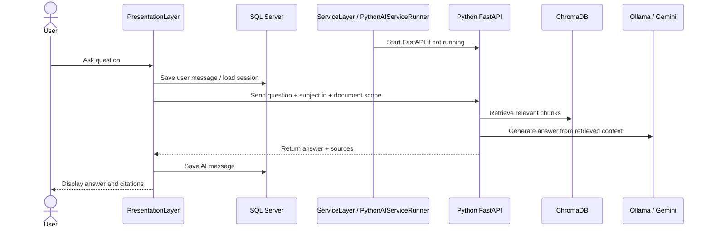

```mermaid
sequenceDiagram
    actor User
    participant PL as PresentationLayer
    participant DB as SQL Server
    participant Runner as ServiceLayer / PythonAIServiceRunner
    participant AI as Python FastAPI
    participant VDB as ChromaDB
    participant LLM as Ollama / Gemini

    Runner->>AI: Start FastAPI if not running

    User->>PL: Ask question
    PL->>DB: Save user message / load session
    PL->>AI: Send question + subject id + document scope
    AI->>VDB: Retrieve relevant chunks
    AI->>LLM: Generate answer from retrieved context
    AI-->>PL: Return answer + sources
    PL->>DB: Save AI message
    PL-->>User: Display answer and citations
```