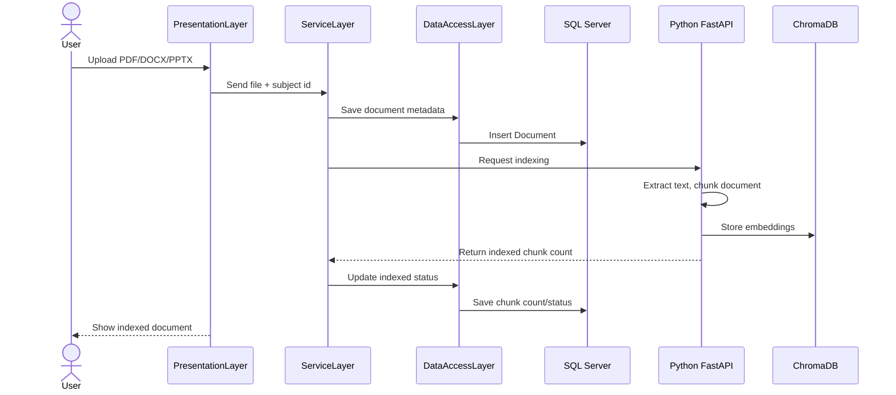

```mermaid
sequenceDiagram
    actor User
    participant PL as PresentationLayer
    participant SL as ServiceLayer
    participant DAL as DataAccessLayer
    participant DB as SQL Server
    participant AI as Python FastAPI
    participant VDB as ChromaDB

    User->>PL: Upload PDF/DOCX/PPTX
    PL->>SL: Send file + subject id
    SL->>DAL: Save document metadata
    DAL->>DB: Insert Document
    SL->>AI: Request indexing
    AI->>AI: Extract text, chunk document
    AI->>VDB: Store embeddings
    AI-->>SL: Return indexed chunk count
    SL->>DAL: Update indexed status
    DAL->>DB: Save chunk count/status
    PL-->>User: Show indexed document
```